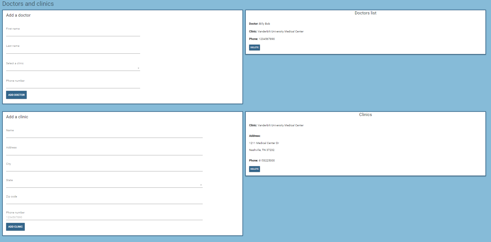

# HealthCare Application

## Overview

The **HealthCare Application** is a feature-rich, user-centric application designed to empower users to manage their health records efficiently. Built using the MERN stack (MongoDB, Express, React, Node.js), this application offers a seamless interface for tracking health logs, managing prescriptions, scheduling appointments, and maintaining a symptom journal. 

This project showcases my ability to develop a complete frontend application from scratch, utilizing modern web development technologies and adhering to best practices in user experience design.

## Features

- **User Authentication**: Secure login and signup features for personalized access to health information.
- **Health Log**: Allows users to document and track their health-related data over time.
- **Symptom Journal**: Users can record symptoms and monitor any changes or patterns over time.
- **Appointments Management**: A streamlined way for users to keep track of their upcoming and past appointments.
- **Prescriptions**: Convenient storage and access to current and past prescriptions, with relevant details.
- **Doctors and Clinics**: A section for users to save and manage information about their healthcare providers.

## Screenshots

- **Login Screen**: User-friendly login interface ensuring secure access.
  
- **Dashboard**: An intuitive dashboard providing easy navigation to all health-related features.
  
- **My Health Log**: A detailed view of the user's health records with easy entry and update options.
  
- **My Symptom Journal**: Simple interface for logging and reviewing symptoms.
  
- **Appointments**: Calendar view for managing healthcare appointments effectively.
  
- **My Prescriptions**: Organized display of current and past prescriptions.
  
- **Doctors and Clinics**: Contact and details management for healthcare providers.
  

## Technologies Used

- **Frontend**:
  - **React**: For building a dynamic and responsive user interface.
  - **Redux**: To manage the state of the application efficiently.
  - **CSS**: For styling and layout.
  - **JavaScript (ES6+)**: The core language used for building the interactive features.

- **Backend (Not included in this version)**:
  - **Node.js & Express**: For handling server-side logic and API requests.
  - **MongoDB**: For storing user data securely.

## Installation

Since this project is currently not deployable, the following steps will guide you to run the frontend locally:

1. Clone the repository:
   ```bash
   git clone https://github.com/yourusername/healthcare-app.git
   ```
2. Navigate to the project directory:
   ```bash
   cd healthcare-app
   ```
3. Install dependancies
   ```bash
   npm install
   ```
4. Start the application
   ```bash
   npm start
   ```
5. Go to localhost:3000

## Demo
[Watch the Demo Video here!](https://youtu.be/s8nJC0PgYFI)

## Future Enhancements
- **Deployment:** Planning to deploy the application to a cloud-based platform for easy access.
- **Improved User Interface:** Enhancing the UI/UX with more interactive elements and responsive design.
